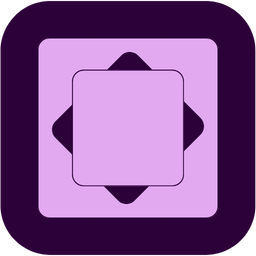

# Aces — All-in-One Productivity Dashboard

Aces is a cross-platform desktop productivity suite designed to streamline your daily workflow. Built with a focus on speed, aesthetics, and user experience, Aces brings together financial tracking, task management, scheduling, and note-taking into a single, cohesive interface.




## ✨ Features

- 📊 **Dynamic Dashboard**: A unified overview of productivity metrics, weather forecasts, upcoming deadlines, and financial status.
- 💸 **Cashflow Tracker**: Professional-grade personal finance management.
  - Track income and expenses with monthly filtering.
  - Daily spending charts and analytics.
  - Automated "Most Spent Category" insights.
- 🎓 **Assignment Board**: Kanban-style tracking for student/professional projects with drag-and-drop status changes and calendar-based due dates.
- ⏱️ **Focus Timer**: Built-in Pomodoro-style timer with customizable presets and audio alerts.
- 📝 **Notes Workspace**: Minimalist digital scratchpad with autosave and export capabilities.
- 📅 **Schedule Manager**: Integrated 24-hour weekly grid for managing appointments and focus blocks.
- 🎨 **Modern Aesthetics**: Built with a sleek OKLCH-based design system, Geist typography, and smooth micro-animations.
- 🌓 **Adaptive Themes**: Refined Dark and Light modes with a seamless toggle.

## 🚀 Tech Stack

- **Core**: [Electron](https://www.electronjs.org/), [React 18](https://react.dev/), [Vite 5](https://vitejs.dev/).
- **Styling**: [Tailwind CSS 4](https://tailwindcss.com/) (Atomic CSS), [Shadcn UI](https://ui.shadcn.com/).
- **Logic**: [TypeScript](https://www.typescriptlang.org/), [React Hook Form](https://react-hook-form.com/), [Zod](https://zod.dev/).
- **Data Viz**: [Recharts](https://recharts.org/).
- **Persistence**: Data is persisted locally in `localStorage` for privacy and speed.

## 🛠️ Development

### Prerequisites

- Node.js 18+
- npm or yarn

### Getting Started

1. **Clone the repository**:
   ```bash
   git clone https://github.com/binnewbs/Aces.git
   cd Aces
   ```

2. **Install dependencies**:
   ```bash
   npm install
   ```

3. **Run the development server**:
   ```bash
   npm run dev
   ```

4. **Build the production application**:
   ```bash
   npm run build
   ```

## 📂 Project Structure

```text
electron/           Electron main and preload processes
public/             Static assets like icons and audio
src/
  components/       Reusable UI and feature components
  hooks/            Shared React hooks
  lib/              Stores, utilities, and seed data
  pages/            Top-level route pages
```

## 📄 License

Private project for personal use.

---

Built with ❤️
